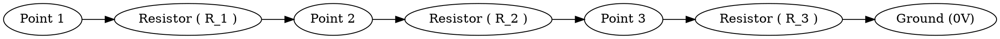
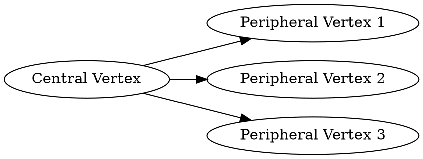

# 6. Graph:

## Context Path
Physics > LABS

## Content
> **AI Generated Content**
 # Graph Theory in Physics Laboratories

## Core Definitions

### Graph
A graph is a mathematical structure consisting of vertices (or nodes) and edges. Formally, it can be represented as \( G = (V, E) \), where:
- \( V \) is the set of vertices.
- \( E \) is the set of edges, which are pairs of vertices indicating a connection between them.

### Types of Graphs
1. **Undirected Graph**: Edges have no direction and are typically represented by an unordered pair of vertices.
2. **Directed Graph (Digraph)**: Edges have a specific direction from one vertex to another.
3. **Weighted Graph**: Edges have weights associated with them, which can represent distances, costs, or other quantities.
4. **Complete Graph**: Every pair of distinct vertices is connected by an edge.
5. **Bipartite Graph**: Vertices can be divided into two disjoint sets such that no two graph vertices within the same set are adjacent.

## Practical Applications in Physics Laboratories

### Network Analysis
- **Electrical Circuits**: Modeling electrical circuits as graphs where nodes represent components (resistors, capacitors) and edges represent connections between them. This is useful for analyzing current flow and voltage distribution.
- **Optical Fiber Networks**: Simulating the propagation of light through optical fibers using graph theory to optimize network configurations.

### Quantum Mechanics
- **Quantum Graphs**: Studying quantum systems where particles move along edges with specific rules at vertices, useful in understanding quantum transport phenomena.
- **Topological Insulators**: Using graphs to model the band structure of topological insulators and understand their unique properties.

### Condensed Matter Physics
- **Percolation Theory**: Analyzing the connectivity of a graph to determine if there is a continuous path from one end to another, crucial for understanding phase transitions in materials.
- **Spin Glasses**: Modeling magnetic systems where spins interact with each other through complex networks represented by graphs.

## Relationships to Parent Concepts

### Physics and Mathematics
Graph theory provides a bridge between physics and mathematics, allowing physicists to model complex systems using mathematical structures. Many physical phenomena can be understood better when formulated in terms of graphs due to their inherent structure and connectivity properties.

### Laboratory Experiments
In laboratory settings, graph theory is often used to design experiments, analyze data, and interpret results. For example:
- **Circuit Analysis**: Using Kirchhoff's laws to solve for currents and voltages in circuits modeled as graphs.
- **Network Simulations**: Simulating the behavior of complex networks such as neural networks or social networks using graph theory principles.

## Simple Examples

### Example 1: Electrical Circuit
Consider a simple electrical circuit with three resistors \( R_1, R_2, \) and \( R_3 \). The circuit can be represented as an undirected graph where:
- Vertices represent the points in the circuit (nodes where wires meet or endpoints of resistors).
- Edges represent the resistors connecting these points.

```markdown

```

### Example 2: Quantum Graph
Consider a quantum graph where particles move along edges and undergo specific transformations at vertices. For instance, a simple star graph with one central vertex connected to multiple peripheral vertices can be used to model quantum transport in branched structures.

```markdown

```

In summary, graph theory is a powerful tool in physics laboratories, enabling the modeling and analysis of complex systems across various disciplines. By understanding core definitions, practical applications, relationships to parent concepts, and simple examples, researchers can effectively apply graph theory to their experiments and analyses.

## Related Concepts
