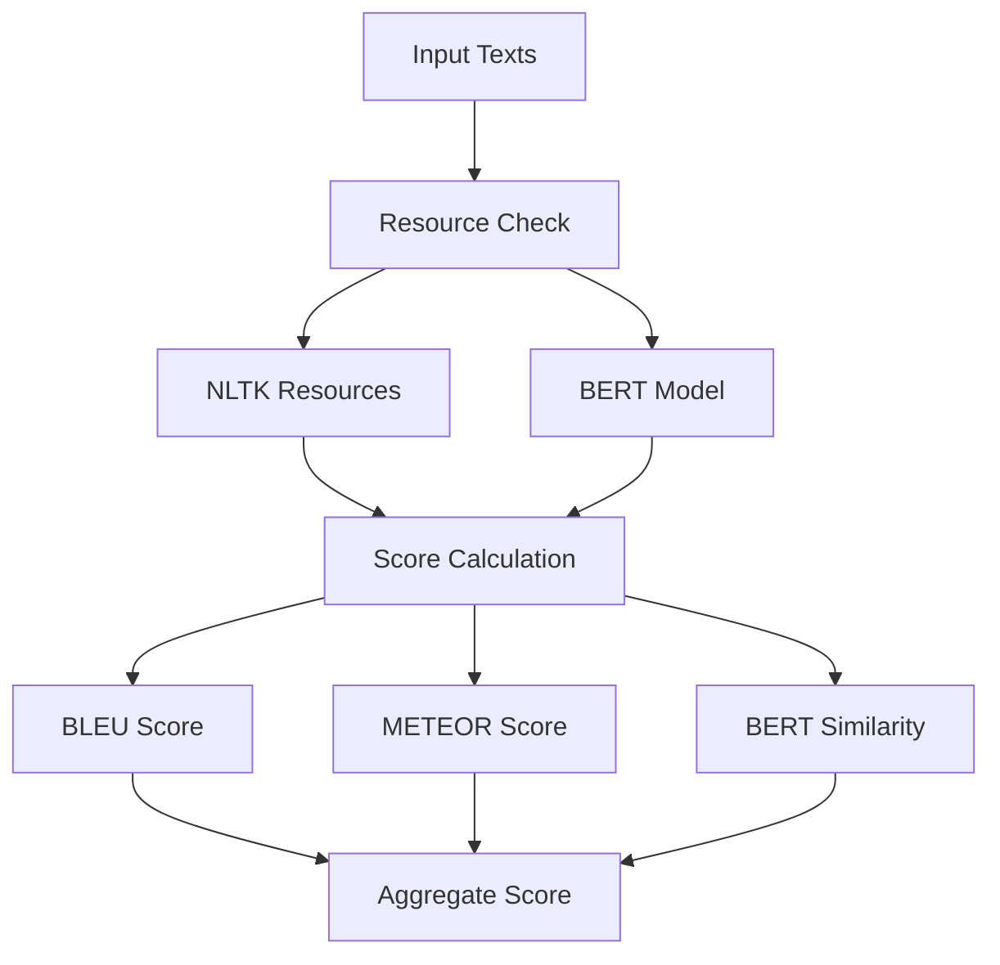

# Presentation For Translation Day

---
theme: default
---

# Translation Quality Evaluation System
A comprehensive framework for assessing translation accuracy

---

## Overview

- Multi-metric evaluation system
- Supports multiple languages
- Uses state-of-the-art NLP techniques
- Comprehensive error handling
- Automated resource management

---

## Key Components

1. **BLEU Score**
   - N-gram based evaluation
   - Weights: (0.25, 0.25, 0.25, 0.25)
   - Improved tokenization handling

2. **METEOR Score**
   - Semantic evaluation
   - Enhanced error handling
   - Language-aware assessment

3. **BERT Similarity**
   - Using all-MiniLM-L6-v2 model
   - Cosine similarity comparison
   - Embedded representation analysis

---

## System Architecture



---

## Resource Management

```python
required_resources = [
    'punkt',
    'wordnet',
    'omw-1.4',
    'averaged_perceptron_tagger',
    'universal_tagset'
]
```

- Automatic download of missing resources
- Graceful error handling
- Verification before processing

---

## BLEU Score Implementation

Key features:
- Case normalization
- Fallback tokenization
- N-gram analysis (1-4 grams)
- Smoothing implementation

```python
weights = (0.25, 0.25, 0.25, 0.25)
reference_tokens = [nltk.word_tokenize(reference)]
candidate_tokens = nltk.word_tokenize(candidate)
```

---

## BERT Similarity Analysis

Process:
1. Text normalization
2. Embedding generation
3. Cosine similarity calculation

```python
embeddings = model.encode([text1, text2])
similarity = cosine_similarity([embeddings[0]], [embeddings[1]])
```

---

## Error Handling Strategy

1. Input validation
2. Resource verification
3. Graceful degradation
4. Detailed error reporting
5. Score normalization

```python
try:
    scores, aggregate_score = evaluate_translation(
        source_text, 
        human_translation
    )
except ValueError as e:
    print(f"Evaluation Error: {str(e)}")
```

---

## Example Usage

```python
source_text = "I'll go to Mumbai tomorrow"
human_translation = "मैं कल मुंबई जाऊंगा"

scores, aggregate_score = evaluate_translation(
    source_text,
    human_translation
)
```

---

## Output Format

Results include:
- Individual metric scores
- Aggregate quality score
- Detailed error messages (if any)

Example:
```python
{
    "BLEU Score (Direct)": 0.7234,
    "METEOR Score (Direct)": 0.6891,
    "BERT Similarity (Direct)": 0.8123,
    "Aggregate Score": 0.7416
}
```

---

## Future Improvements

1. Additional metrics support
2. Language-specific optimizations
3. Custom weight configurations
4. Batch processing capability
5. API integration options

---

## Questions?
